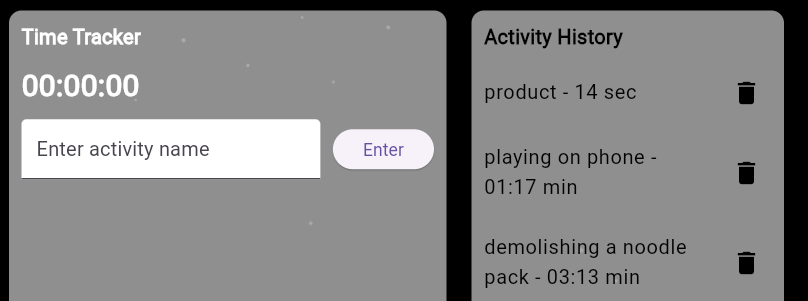

Welcome to **RustySpaces**, your ultimate productivity tool for aligning goals and building consistent habits. Powered by **Rust**, a PostgreSQL database, and a Flutter frontend, RustySpaces delivers high performance with the following integrated features:

**Spaces**: A rusty jampacked space you can create, authenticated by cookies. You can have multiple spaces on the server, each tailored to your needs.

**Sticky Notes**: Within your space, you can create unlimited sticky notes to document weekly goals. Each note includes a checkbox feature, a header, and more. Notes are stored on **Supabase PostgreSQL** database after being serialized and deserialized using Rust.

**TimeTracking**: highly productive feature designed not as a simple stopwatch, but as a tool to track the time spent on activities. It helps you identify areas where you might need to cut down or improve.

**Streaming Music**: Even though our music library is small (just 15 tracks), it's still one of the best! You can constantly stream **NCS, Lofi, and Animation** music from the Rust/Rocket server while jotting down notes, time tracking, or working across tabs in your PC.

### Access App here: https://rustyspaces.up.railway.app/

> NB: the extras directory contains extra code n resources - `a lib directory` which contains my flutter frontend components, these has been built and compiled into dart and javascript but these are the original files. AND `a database directory` which contains csv files of the table and rows formatting from supabase.

### **Technical Details:**

-   the frontend, built with Flutter, integrates seamlessly with Rust and is copied to the `/static` folder after each build using a custom script. check it out here
-   Supabase Postgres is integrated without the need for a `.env` file when running locally - it uses the Database URL specified in `Rocket.toml` for connections.

> NB: `.env` was required while i built the table migrations but isn't required for interacting with database

-   rust's **Rocket, Diesel, and Tokio libraries** are utilized to create the backend web server, manage the database connections, and handle asynchronous streaming.
-   the music is streamed in **byte chunks**, and on the frontend, HTML Blob is used for processing since the Flutter audioplayers package couldn't handle this for the web.
-   the sticky notes structure was initially complex due to the need for **custom serialization of individual lines**. but i found a workaround and all lines are stored as an array and split on the frontend using a delimiter (`|`).
-   deployment is handled using a **Dockerfile** on the Railway service. It copies selected files, runs build commands like a local environment, and grants permission to execute the compiled binary.

### **How to Use**

- **create a space**

- **create a stickynote**

- **create timetracking**

**How to Run Locally:** running the app locally can significantly improve the performance of streaming.

1.  clone the repo using the following command:
    `git clone [repo-url]` 
    
2.  update the dependencies with:
    `cargo update` 
    
3.  start the application by running:
    `cargo run` 

4.  access the app using: `http://127.0.0.1:8080/`

5.  if you get an error about database pooling: `go to rocket.toml and change the pool_size to 1 - 5`, retry `cargo run`
    
    That's all!

> **NB:** the app was designed with the goal of being fully responsive on mobile devices, and thanks to Flutter, it almost is. **However,** please be aware that your cookies won't transfer! xD
